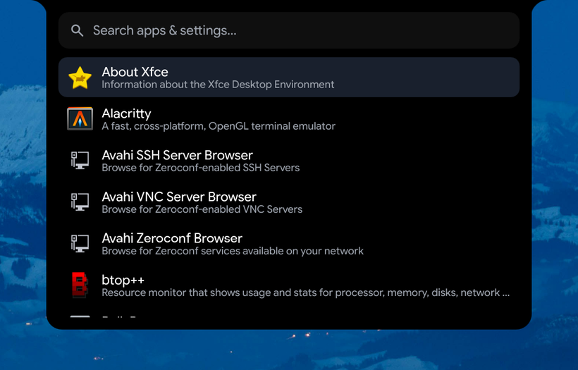
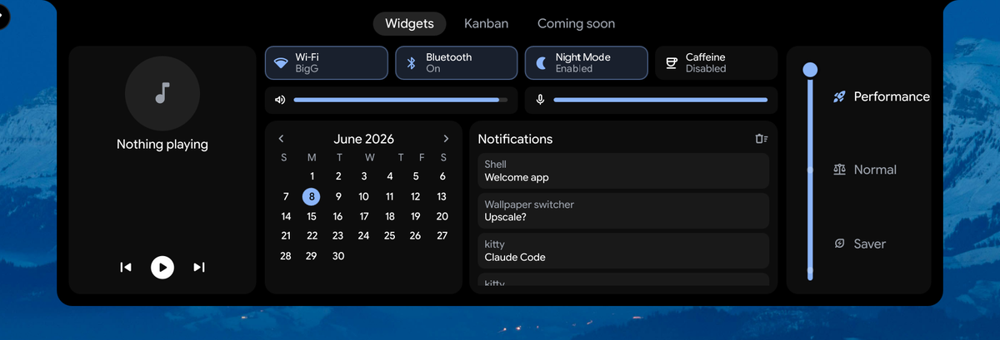

<h1 align="center">Brolli-Glass</h1>

<p align="center"><b>A macOS-style Dynamic Island desktop for Hyprland.</b></p>

<p align="center">Built in <a href="https://quickshell.outfoxxed.me/">Quickshell</a>/QML on top of the <a href="https://github.com/end-4/dots-hyprland">end-4 / illogical-impulse</a> framework.</p>

<p align="center"></p>

A macOS-shaped desktop: a slim **menubar**, frosted **widgets** sitting on the wallpaper, and a
magnifying **dock**. The centrepiece is a **morphing notch** — a minimal clock when idle that
expands for volume, brightness, media, notifications, and dashboards.

---

## 🍎 Menubar, notch, dock

<p align="center"></p>

- **Left** — traffic lights and real app menus (Window · Go · Capture · Focus), plus a system menu
- **Centre (the notch)** — the morphing star: clock → OSDs → media → surfaces
- **Right** — audio · bluetooth · network · battery · tray · clock

<p align="center"></p>

The **dock** magnifies on hover, marks running apps, and its Trash reflects whether the Trash
actually has anything in it.

<p align="center"></p>

**Widgets** — clock, calendar, to-do — live on their own layer above the wallpaper and below every
window. Desktop icons share that space and step aside when a widget covers them, returning home
when it moves away.

Fully **multi-monitor**: everything renders per-monitor in correct logical coordinates (scaled and
rotated displays included), and a surface opens only on the monitor you clicked.

---

## 🌀 The notch morphs

Click it — or let it react. Goey spring animations the whole way.

<table>
<tr>
<td></td>
<td></td>
</tr>
<tr>
<td align="center"><i>Volume / brightness OSD</i></td>
<td align="center"><i>Fuzzy app &amp; settings launcher</i></td>
</tr>
<tr>
<td></td>
<td></td>
</tr>
<tr>
<td align="center"><i>Dashboard — toggles, media, calendar, notifications</i></td>
<td align="center"><i>Workspace overview (drag windows between workspaces)</i></td>
</tr>
</table>

…plus media with an audio visualizer, brightness, notifications, a power menu, and screen-capture tools.

---

## Requirements

- **Hyprland** with the **end-4 / illogical-impulse** setup (provides the Lua-based Hyprland config —
  `hl.dsp.*` dispatch — plus all packages, fonts, services, and the Quickshell framework). Arch-based
  (CachyOS, EndeavourOS, …) is the smoothest path.
- **Quickshell** ≥ 0.2.1 (installed by the end-4 setup).

---

## Install (set it up exactly like the screenshots)

### 1. Install the end-4 base first
Follow <https://github.com/end-4/dots-hyprland>. This sets up Hyprland (with the Lua config), Quickshell,
and every dependency. Make sure that desktop boots and works before continuing.

### 2. Clone this repo into your Quickshell configs
```sh
git clone https://github.com/patheonsceo/Dynamic-island-for-arch.git ~/Projects/brolli-glass
ln -s ~/Projects/brolli-glass/quickshell ~/.config/quickshell/Brolli-Glass
```
Quickshell only loads configs from `~/.config/quickshell/<name>/`, so the symlink points the
`Brolli-Glass` config at the repo. (You can also clone straight into `~/.config/quickshell/Brolli-Glass`.)

### 3. Switch your desktop to it
end-4 picks the Quickshell config from `~/.config/hypr/hyprland/variables.lua`:
```lua
hl.env("qsConfig", "ii")            -- before
hl.env("qsConfig", "Brolli-Glass")  -- after
```
Then relogin, or hot-swap without one:
```sh
pkill -f "qs -c ii"; hyprctl dispatch exec "qs -c Brolli-Glass"
```
You'll see the menubar, notch and dock. To go back, set `qsConfig` to `"ii"`.

### 4. (Optional) Enable voice dictation
Hold **Right Ctrl** to dictate straight into the focused window, with a live
waveform in the notch. It's powered by the external
**[hyprvoice](https://github.com/leonardotrapani/hyprvoice)** daemon + Groq Whisper.
Full setup (dependencies, Groq key, the push-to-talk keybind translated for stock
Hyprland) is in **[docs/voice-dictation.md](docs/voice-dictation.md)**.

---

## Notes & gotchas

- **Multi-monitor / scaled / rotated displays** — handled; each island renders per-monitor in *logical*
  coordinates, surfaces open only on the monitor you clicked.
- **Lua-Hyprland dispatch** — this config uses the `hl.dsp.*` Lua dispatch API (the plain
  `dispatch "focuswindow …"` form silently no-ops on a Lua-config Hyprland).
- **Design / architecture** lives in `NOTES.md`; the running work log is in `PROGRESS.md`.

---

## Credits & license

- Built on **[end-4 / dots-hyprland (illogical-impulse)](https://github.com/end-4/dots-hyprland)** — GPL-3.0.
- Built with **[Quickshell](https://quickshell.outfoxxed.me/)**.
- Notch interaction techniques studied from **[Hyprfabricated](https://github.com/tr1xem/hyprfabricated)**
  (technique only — re-implemented in Quickshell/QML, no code copied).

A derivative work of end-4, released under the **GNU General Public License v3.0** — see
[`LICENSE`](./LICENSE). If you distribute it or a modified version, it must remain GPL-3.0, keep these
notices, and provide source.
