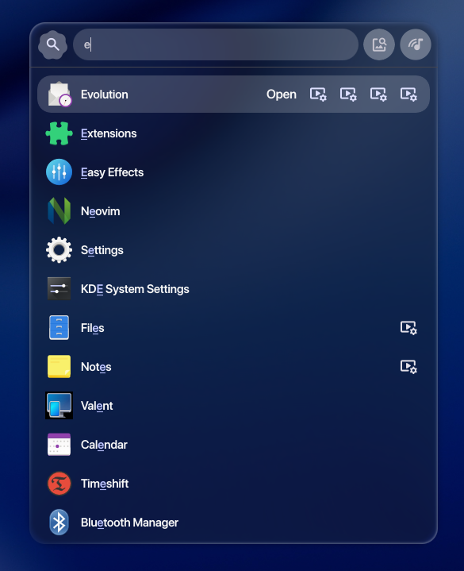

<h1 align="center">BrolliOS</h1>
<h2 align="center">V 0.1.1</h2>

<p align="center"><b>A macOS-style desktop for Hyprland, with liquid glass drawn by the compositor.</b></p>

<p align="center">
  <a href="#-the-glass">The glass</a> ·
  <a href="#install">Install</a> ·
  <a href="docs/README.md">Docs</a> ·
  <a href="#credits">Credits</a>
</p>

<p align="center"></p>

Two halves that only make sense together:

- **BrolliOS** — a [Quickshell](https://quickshell.outfoxxed.me/)/QML shell (menubar, dock,
  desktop widgets, Spotlight), forked from [patheonsceo's OpenAgentIsland](https://github.com/patheonsceo/openagentisland)
  and built on [end-4 / illogical-impulse](https://github.com/end-4/dots-hyprland).
- **Brolli-Glass** — a Hyprland **plugin** that draws the shell's glass *inside the
  compositor*, mid-frame, on stock Hyprland.

The second one is the point of the project. Panels here are not blurred
screenshots: the plugin already holds the frame being composited, so it refracts
the real thing under each surface for about **0.1 W idle and 1 W worst case**.
The shell used to do this with screencopy, in QML, on a patched Hyprland — that
cost ~16 W.

---

## 🍎 The desktop

<p align="center"></p>

**Menubar** — traffic lights and real app menus (Window · Go · Capture · Focus) on
the left, a system menu, and audio · bluetooth · network · Control Centre ·
battery · tray · clock on the right. Every dropdown is glass, and the whole bar's
text flips between light and dark **as one**, following whatever is behind it.

<p align="center"></p>

**Dock** — magnifies on hover, marks running apps.

<p align="center"></p>

**Widgets** — clock, calendar and to-do sit above the wallpaper and below every
window. Desktop icons share that space and step aside when a widget covers them.

<p align="center"></p>

**Spotlight** searches apps, files, maths and shell commands. In short it's end-4's app
launcher with the glass effect.


<p align="center"></p>

**Overview** is the workspace overview, which drags windows between workspaces.
Alongside those: the end-5 sidebars and Control Centre, notifications, OSD,
lock screen, hot corners, an on-screen keyboard, and a
settings app with a live page for every glass uniform.

---

## 🫧 The glass

The shell says *where* and *what*; the plugin decides *how it is drawn*.

```
shell (BrolliOS)                         plugin (Brolli-Glass)
  GlassRegion        ── glassrect ──▶    where each panel is
  GlassUniformBridge ── glassuniform ─▶  every look value, one --batch
  GlassSample        ── glasssample ──▶  regions to measure
                     ◀── glasssample>>   backdrop colour  (adaptive text)
                     ◀── glassstats>>    how busy it is   (readability)
```

The plugin hooks `renderLayer` and queues its own pass element directly under
each surface, so the glass always sits beneath the panel it belongs to — layer
surfaces *and* the menubar's xdg-popups. The backdrop is a `glBlitFramebuffer`
out of the frame in flight. Which panels redraw is decided once per frame, and
anything completely hidden behind an opaque window is dropped.

- **Lensing, not blur.** The look is Apple's Liquid Glass: transparent and
  refractive, with the character living at the edges.
- **Readability per panel, never per pixel.** Each panel measures its whole
  backdrop, then squashes a busy one's contrast and lifts itself slightly; the
  text on it flips black or white to match.
- **No glass on glass.** A panel drawn over glass already drawn this frame drops
  its own softening, this is based on Apple's docs.
- **Every value is a slider** in **Settings → Liquid Glass**, dynamically updates.

**Measured cost** — paired runs on battery, same action with and without the
plugin, 20 s averages of GPU package power. Δ is the glass:

**There are measurements on my own machine, your results may vary. although not by much.**

| scenario | with | without | **Δ GPU** |
|---|---|---|---|
| Idle, dock + widgets up | 3.37 W | 3.28 W | **+0.09 W** |
| Spotlight open, still | 3.48 W | 3.26 W | **+0.22 W** |
| Window dragged behind the dock | 4.96 W | 4.69 W | **+0.27 W** |
| Spotlight expanded, window dragged behind | 5.47 W | 4.96 W | **+0.51 W** |

Full design, the material's maths and every gotcha: **[`plugin/README.md`](plugin/README.md)**.

---

## Requirements

- **Hyprland** with the **end-4 / illogical-impulse** setup (its Lua-based Hyprland
  config, packages, fonts, services and Quickshell).
- **Quickshell** ≥ 0.2.1 (installed by the end-4 setup).
- A C++ compiler and the **Hyprland headers**, to build the plugin.
- **Fonts are not shipped** — none of them may be redistributed. The installer
  pulls SF Pro Display and Liga SF Mono from the AUR; Google Sans Flex comes
  with the end-4 base.

Details in [docs/requirements.md](docs/requirements.md).

## Install

```sh
git clone https://github.com/JolliBrolli/Brolli-Glass.git ~/Projects/Brolli-Glass
cd ~/Projects/Brolli-Glass
./install.sh # THIS WILL OVERWRITE YOUR HYPRLAND CONFIG,
             # it creates a backup just an fyi
```

That is the whole desktop: the end-4 base (delegated to end-4's own installer),
then every artifact in [`manifest.toml`](manifest.toml) — icons, theme, GTK and
Qt settings, wallpapers, Hyprland config, terminal and launcher — then the glass
plugin, built to `~/.local/share/brolli-glass/`. Everything it writes is backed up before
the first change, so `./install.sh --uninstall` puts the machine back.

### Already have a rice you like?

`--profile shell` takes **only the shell**, and touches nothing else you have
set up:

```sh
./install.sh --profile shell --skip-base
```

That installs exactly two things — a copy of the shell at
`~/.config/quickshell/BrolliOS` and a marker-delimited block in end-4's
`variables.lua` pointing Quickshell at it — then builds the plugin. Your icons, GTK theme, wallpapers,
terminal, keybinds and **your monitor config** are left alone.

The one thing to add yourself, since it lives in the Hyprland config this
profile skips:

```lua
-- ~/.config/hypr/custom/execs.lua
hl.plugin.load(os.getenv("HOME") .. "/.local/share/brolli-glass/brolli-glass.so")
```

Without it the shell runs, but with no glass until you load the plugin by hand.

### Every flag

```sh
./install.sh --profile shell  # just the shell and its Hyprland glue
./install.sh --skip-base      # you already run end-4
./install.sh --link           # symlink the shell to this repo (development)
./install.sh --dry-run        # print every action, change nothing
./install.sh --status         # how the live system differs from the repo
./install.sh --uninstall      # restore the original backup
./install.sh --help
```

Relog when it finishes (or `pkill -x qs; setsid -f qs -c BrolliOS`). The plugin
loads from `~/.config/hypr/custom/execs.lua` at startup; to load it now,
`hyprctl plugin load ~/.local/share/brolli-glass/brolli-glass.so`.

## Layout

| path | what |
|---|---|
| `quickshell/` | the shell — **copied** to `~/.config/quickshell/BrolliOS` on install |
| `plugin/src/brolli-glass.cpp` | the Hyprland plugin |
| `plugin/src/brolliglass.frag` | the material, read from disk at plugin load |
| `install.sh`, `manifest.toml`, `install/` | the installer |
| `NOTES.md` | how the whole thing is put together |
| `PROGRESS.md` | the work log, newest first |

## Notes & gotchas

- **Never `cp` over the loaded `.so`.** Hyprland has it mapped and the next
  unload takes the session with it. Unload → copy to a temp name → `mv` → load.
- **The plugin is pinned to its Hyprland build.** Rebuild after a Hyprland
  update: `install/scripts/build-plugin.sh`.
- **Lua-Hyprland dispatch** — this config uses the `hl.dsp.*` API; the plain
  `dispatch "focuswindow …"` form silently no-ops on a Lua-config Hyprland.
- Useful while poking at it: `hyprctl glassopt` (state, panels, draw counts).

---

## Credits

**Brolli-Glass is a fork of [OpenAgentIsland](https://github.com/patheonsceo/openagentisland) by
[patheonsceo](https://github.com/patheonsceo)**, which is itself built on
**[end-4 / dots-hyprland](https://github.com/end-4/dots-hyprland)**. The installer, the docs, and
the first dock, menubar and desktop widgets are patheonsceo's work; most of the
rest of the desktop is end-4's. What is new here is the glass and a more polished MacOS focused style.

- **[end-4 / dots-hyprland (illogical-impulse)](https://github.com/end-4/dots-hyprland)** — the
  framework everything sits on, and most of the desktop that isn't macOS-shaped.
  without this none of this desktop would be possible :)
- **[patheonsceo / OpenAgentIsland](https://github.com/patheonsceo/openagentisland)** — the
  project this is forked from. Its notch and agent monitor were removed here;
  its installer, docs and macOS surfaces live on :)
- **[Quickshell](https://quickshell.outfoxxed.me/)** (outfoxxed) — the QML runtime the shell is
  written in.
- **[Hyprland](https://hyprland.org/)** (vaxry and contributors) — the compositor, and the
  plugin API that lets the glass be drawn mid-frame without patching it.
- **[Aghajari](https://www.aghajari.com/publications/liquid-glass/)** — the Liquid Glass
  recreation this material is built from.
- **[ShojiWM](https://github.com/bea4dev/shoji)** (bea4dev) — edge handling, and the
  shell-draws-a-silhouette / compositor-draws-the-glass split.
- **HyprGlass** — prior art; it showed a Hyprland plugin could do this at all.
- **[Hyprtasking](https://github.com/raybbian/hyprtasking)** (raybbian) — taught the plugin to
  honour render modifiers, so glass stops floating over the overview.
- **[WhiteSur](https://github.com/vinceliuice/WhiteSur-icon-theme)** (vinceliuice) — the icon theme.
- **Apple**, WWDC25 *Meet Liquid Glass* — the design targets. Behaviour described,
  never implementation.

Fonts are proprietary and not shipped; see [Requirements](docs/requirements.md).

## License

A derivative work of end-4 / dots-hyprland, released under the **GNU General
Public License v3.0** — see [`LICENSE`](./LICENSE). If you distribute it, or a
modified version, it must stay GPL-3.0, keep these notices, and ship source.
